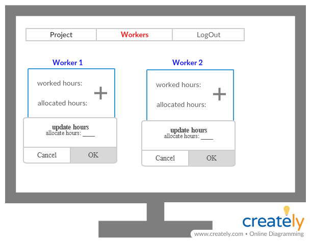

# Finaly project - Task Managment

## Using this technologies:
* MySql
* Web api
* WinForms
* Angular

## System diagram:


***
## Web api
### Models
* Worker:
    * Id - int 
    * Name - string - minLength: 2, maxLength:15, reqiered
    * UserName - string - minLength: 2, maxLength:10, reqiered, uniqe
    * Password - string - minLength: 6, maxLength:10, reqiered
    * Email - string  ,minLength: 6, maxLength:30,reqiered
    * job - int - will contain the id of job's type
    * ManagerName - string -minLength: 2, maxLength:15   
* Project:
    * Id - int 
    * Name - string -  minLength: 2, maxLength:25,uniqe, reqiered,
    * CustomerName - string -  minLength: 2, maxLength:15, reqiered,
    * TeamLeader - `Worker` type - reqiered-  will contain the id of the project manager
    * DevelopHoures - int - reqiered
    * QAHoures - int - reqiered
    * UIUXHoures - int - reqiered
    * StartDate - date - reqiered 
    * EndDate - date - reqiered, must be after `StartDate`
* ProjectWorker:
    * Id - int 
    * Worker - `Worker` type
    * Project - `Project` type
    * AllocatedHours - int 
    * WorkHours - int
* Job:
     * Id - int
     * Name - string

### Controllers
* Home controller:
    * Post - sign in to the system    
    requierd data: 
        * userName
        * password
    If the user is valid - we will check his status and navigate him to the currect main page, Else - we will return a matching error
    * Post - change password
    requierd data: 
        * userName
        * oldPassword
        * newPassword
    If the user want to change your password
* Manager controller:
    * Post - add a new project   
    requierd data: 
        * ProjectName
        * CostumerName
        * TeamLeaderName
        * DevelopHoures
        * QAHoures
        * UIUXHoures
        * StartDate 
        * EndDate 
    If the project details is valid - we will add the project to the DB and also add all the workers that bellow to the team-leader to this projects
    * Post - add a new worker
    requierd data: 
          * Name
          * UserName 
          * Password 
          * Email 
          * job 
          * Manager 
    * Get - get all the details that the manager need to the report
    * Get - get all managers - to choose for each worker your manager
    * Get - get all jobs - to choose for each worker your job type
    * Get - get all workers
    * Get - get presence- get the presence for each worker can be filter by month,project and name
    * Put - edit worker's details 
    requierd data: 
          * Name
          * UserName 
          * Email 
          * job 
          * Manager 
    The manager can not change the worker's password     
    * Delete - the manager can delete worker - It possible to delete just a worker and not a team-leader
* TeamLeader controller:
    * Get - get the details and status of the current project that the team-leader manage
    * Get - get the details for each worker that bellow him
    * Get - get all the hours that used in this month 
    * Get - get worker's hours to each worker
    * Put - update worker's hours - The team-leader need to update for each worker
* Worker controller:
    * Post - the worker can send massage to his team-leader
    * Post - for update the hour that he started to work
    * Get - get the worker details
    * Get - get the project that he work now
    * Get - get all the hours that he worked
***
# Code of each tier

### DAL
```csharp
using MySql.Data.MySqlClient;
using System;
using System.Collections.Generic;

namespace DAL
{
    public static class DBAccess
    {
        static MySqlConnection Connection = new MySqlConnection("SERVER=127.0.0.1;PORT=3306;UID=root;persistsecurityinfo=True;DATABASE=task_managment;SslMode=none");
        public static int? RunNonQuery(string query)
        {
            lock (Connection)
            {
                try
                {
                    Connection.Open();
                    MySqlCommand command = new MySqlCommand(query, Connection);
                    return command.ExecuteNonQuery();
                }
                catch (Exception e)
                {
                    return null;
                }
                finally
                {
                    if (Connection.State != System.Data.ConnectionState.Closed)
                    {
                        Connection.Close();
                    }
                }
            }
        }

        public static object RunScalar(string query)
        {
            lock (Connection)
            {
                try
                {
                    Connection.Open();
                    MySqlCommand command = new MySqlCommand(query, Connection);
                    return command.ExecuteScalar();
                }
                catch (Exception e)
                {
                    return null;
                }
                finally
                {
                    if (Connection.State != System.Data.ConnectionState.Closed)
                    {
                        Connection.Close();
                    }
                }
            }
        }

        public static List<T> RunReader<T>(string query, Func<MySqlDataReader, List<T>> func)
        {
            lock (Connection)
            {
                try
                {
                    Connection.Open();
                    MySqlCommand command = new MySqlCommand(query, Connection);
                    MySqlDataReader reader = command.ExecuteReader();
                    return func(reader);
                }
                catch (Exception ex)
                {
                    return null;
                }
                finally
                {
                    if (Connection.State != System.Data.ConnectionState.Closed)
                    {
                        Connection.Close();
                    }
                }
            }
        }
    }
}

```

### BOL
```csharp
using BOL.validations;
using System.ComponentModel.DataAnnotations;

namespace BOL
{
    public class Worker
    {
        [Key]
        public int Id { get; set; }
        [Required]
        [MinLength(2), MaxLength(15)]
        public string Name { get; set; }
        [Required]
        [MinLength(2), MaxLength(10)]
        [UniqeUserName]
        public string UserName { get; set; }
        [Required]
        [MinLength(6), MaxLength(64)]
        public string Password { get; set; }
        public int JobId { get; set; }
        [Required]
        [MinLength(6), MaxLength(30)]
        public string EMail { get; set; }
        public int? ManagerId { get; set; }

    }
}

```
```csharp
using BOL.validations;
using System;
using System.ComponentModel.DataAnnotations;

namespace BOL
{
    public class Project
    {
        [Key]
        public int Id { get; set; }
        [Required]
        [MinLength(2), MaxLength(25)]
        [UniqeName]
        public string Name { get; set; }
        public int TeamLeaderId { get; set; }
        [Required]
        [MinLength(2), MaxLength(15)]
        public string Customer { get; set; }
        [Required]
        public int DevelopHours { get; set; }
        [Required]
        public int QAHours { get; set; }
        [Required]
        public int UiUxHours { get; set; }
        [Required]
        public DateTime StartDate { get; set; } = DateTime.Today;
        [Required]
        public DateTime EndDate { get; set; }
    }
}
```
```csharp
using System.ComponentModel.DataAnnotations;

namespace BOL
{
  public  class ProjectWorker
    {
        [Key]
        public int Id { get; set; }
        public int WorkerId { get; set; }
        public Project ProjectId { get; set; }
        public float AllocatedHours { get; set; } 
    }
}
```
```csharp
using System;
using System.ComponentModel.DataAnnotations;

namespace BOL
{
    class WorkHours
    {
        [Key]
        public int Id { get; set; }
        public int ProjectWorkId { get; set; }
        public DateTime Date { get; set; }
        public DateTime Start { get; set; }
        public DateTime End { get; set; }
    }
}
```
```csharp
using System.ComponentModel.DataAnnotations;

namespace BOL
{
    public class Job
    {
        [Key]
        public int Id { get; set; }
        [Required]
        [MinLength(2), MaxLength(15)]
        public string Name { get; set; }
    }
}
```

### BLL
```csharp
using BOL;
using DAL;
using MySql.Data.MySqlClient;
using System;
using System.Collections.Generic;
using System.Net;
using System.Net.Mail;
using System.Timers;

namespace BLL
{
    public static class HomeLogic
    {
        public static Worker Login(string userName, string password)
        {
            string query = $"SELECT * FROM task_managment.workers WHERE user_name='{userName}' and password='{password}' ";
            Func<MySqlDataReader, List<Worker>> func = (reader) => {
                List<Worker> worker = new List<Worker>();
                while (reader.Read())
                {
                    worker.Add(new Worker
                    {
                        Id = reader.GetInt32(0),
                        Name = reader.GetString(1),
                        UserName = reader.GetString(2),
                        Password = "",
                        EMail = reader.GetString(4),
                        JobId = reader.GetInt32(5),
                        ManagerId = reader[6] as int?
                    });
                }
                return worker;
            };
            List<Worker> workers= DBAccess.RunReader(query, func);
            if (workers != null && workers.Count > 0)
                return workers[0];
            return null;
        }

        public static bool UpdatePassword(string userName, string oldpassword, string newPassord)
        {
            string query =$" UPDATE workers SET password = '{newPassord}' WHERE user_name = '{userName}' AND password = '{oldpassword}'";
            return DBAccess.RunNonQuery(query) == 1;
        }

        public static bool sendEmail(string sub, string body, string email)
        {
            MailMessage msg = new MailMessage();
            msg.From = new MailAddress("shtilimrishum2018@gmail.com");
            msg.To.Add(new MailAddress(email));
            msg.Subject = sub;
            msg.Body = body;
            SmtpClient client = new SmtpClient();
            client.UseDefaultCredentials = true;
            client.Host = "smtp.gmail.com";
            client.Port = 587;
            client.EnableSsl = true;
            client.DeliveryMethod = SmtpDeliveryMethod.Network;
            client.Credentials = new NetworkCredential("shtilimrishum2018@gmail.com", "0504190762");
            client.Timeout = 20000;
            try
            {
                client.Send(msg);
                return true;
            }
            catch (Exception ex)
            {
                return false;
            }
            finally
            {
                msg.Dispose();
            }
        }
   
        public static void OnStart(object sender, ElapsedEventArgs args)
        {
            string query = $"SELECT w.email, p.name ,p.end_date" +
            $" FROM workers w JOIN project_workers pw ON W.worker_id = pw.worker_id JOIN projects p" +
            $" ON p.project_id = pw.project_id" +
            $" WHERE p.end_date <= NOW() + INTERVAL 1 DAY" +
             $" UNION SELECT w.email, p.name ,p.end_date" +
            $" FROM workers w JOIN projects p ON p.team_leader = W.worker_id" +
             $" WHERE p.end_date <= NOW() + INTERVAL 1 DAY";

            Func<MySqlDataReader, List<object>> func = (reader) => {
                List<object> objects = new List<object>();
                while (reader.Read())
                {
                    var o = new
                    {
                        email = reader.GetString(0),
                        name = reader.GetString(1),
                        end_date = Convert.ToDateTime(reader.GetString(2)),
                    };
                    sendEmail("Notification do not end task", $"the project {o.name} end in {o.end_date}!!", o.email);
                }
                return objects;
            };
            List<object> objects2 = DBAccess.RunReader(query, func);
        }
        public static  void Notifications()
        {
            OnStart(null, null);
            Timer timer = new Timer();
            timer.Interval = 60000*60*24; // once a day
            timer.Elapsed += new ElapsedEventHandler(OnStart);
            timer.Start();
        }
    }
}
```
```csharp
using BOL;
using DAL;
using MySql.Data.MySqlClient;
using System;
using System.Collections.Generic;

namespace BLL
{
    public class ManagerLogic
    {
        public static bool AddProject(Project project)
        {
            string query = $"INSERT INTO task_managment.projects  " +
                $"(name,customer,team_leader,develop_houres,qa_houres,ui_ux_houres,start_date,end_date)" +
                $" VALUES ('{project.Name}','{project.Customer}'," +
                $"'{project.TeamLeaderId}',{project.DevelopHours},{project.QAHours},{project.UiUxHours}," +
                $"'{project.StartDate.Year}-{project.StartDate.Month}-{project.StartDate.Day}','{project.EndDate.Year}-{project.EndDate.Month}-{project.EndDate.Day}')";
            if (DBAccess.RunNonQuery(query) == 1)
            {
                return AddWorkersToProject(project);
            }
            return false;
        }

        private static bool AddWorkersToProject(Project project)
        {
            var query = $"SELECT project_id FROM projects WHERE name = '{project.Name}'";
            int idProject = (int)DBAccess.RunScalar(query);
            query = $"SELECT worker_id FROM workers" +
                    $" WHERE manager ={project.TeamLeaderId}";
            List<int> workersId = new List<int>();
            Func<MySqlDataReader, List<int>> func = (reader) =>
            {
                List<int> workers = new List<int>();
                while (reader.Read())
                {
                    //Add all the teamLeadr's worker to the project
                    workers.Add(reader.GetInt32(0));
                }
                return workers;
            };

            workersId = DBAccess.RunReader(query, func);
            workersId.ForEach(idWorker =>
            {
                var q = $"INSERT INTO project_workers (worker_id,project_id) VALUES({idWorker},{idProject})";
                DBAccess.RunNonQuery(q);
            });
            return true;
        }

        public static bool addWorkersToProject(int[] ids, string name)
        {
            string q = $"SELECT project_id FROM projects WHERE name = '{name}'";
            int idProject = (int)DBAccess.RunScalar(q);
            foreach (var item in ids)
            {
                string query = $"INSERT INTO task_managment.project_workers (worker_id,project_id) VALUES({item},{idProject})";
                if (DBAccess.RunNonQuery(query) == 0)
                    return false;
            }
            return true;
        }

        public static bool AddWorker(Worker worker)
        {
            string query = $"INSERT INTO task_managment.workers  " +
                $"(name,user_name,password,email,job,manager)" +
                $" VALUES ('{worker.Name}','{worker.UserName}'," +
                $"'{worker.Password}','{worker.EMail}',{worker.JobId},{worker.ManagerId})";
          if (DBAccess.RunNonQuery(query) == 1)
            {
                int id =(int)DBAccess.RunScalar( $" SELECT worker_id FROM workers WHERE user_name = '{worker.UserName}'");
                string query2 = $" SELECT project_id FROM task_managment.projects WHERE team_leader={worker.ManagerId}";
                Func<MySqlDataReader, List<int>> func = (reader) =>
                {
                    List<int> projectsId = new List<int>();
                    while (reader.Read())
                    {
                        projectsId.Add(reader.GetInt32(0));
                    }
                    return projectsId;
                };

                List<int> projectsIds= DBAccess.RunReader(query2, func);
                projectsIds.ForEach(p =>
                {
                    string query3 = $"INSERT INTO task_managment.project_workers (worker_id,project_id) VALUES ({id},{p})";
                    DBAccess.RunNonQuery(query3);
                });
                return true;
            }
            return false;
        }

        public static bool UpdateWorker(Worker worker)
        {
               string  query = $"UPDATE task_managment.workers SET name='{worker.Name}', user_name='{worker.UserName}'" +
                $", email='{worker.EMail}', job={worker.JobId}, manager={worker.ManagerId} WHERE worker_id={worker.Id}";
            return DBAccess.RunNonQuery(query) == 1;
        }

        public static List<Worker> GetAllWorkers()
        {
            string query = $"SELECT * FROM task_managment.workers";
            Func<MySqlDataReader, List<Worker>> func = (reader) =>
            {
                List<Worker> workers = new List<Worker>();
                while (reader.Read())
                {
                    workers.Add(new Worker
                    {
                        Id = reader.GetInt32(0),
                        Name = reader.GetString(1),
                        UserName = reader.GetString(2),
                        Password = "",
                        EMail = reader.GetString(4),
                        JobId = reader.GetInt32(5),
                        ManagerId = reader[6] as int?

                    });
                }
                return workers;
            };
            return DBAccess.RunReader(query, func);
        }
        public static List<Worker> GetAllManagers()
        {
            string query = $"SELECT * FROM task_managment.workers WHERE job<=2";
            Func<MySqlDataReader, List<Worker>> func = (reader) =>
            {
                List<Worker> managers = new List<Worker>();
                while (reader.Read())
                {
                    managers.Add(new Worker
                    {
                        Id = reader.GetInt32(0),
                        Name = reader.GetString(1),
                        UserName = reader.GetString(2),
                        Password = "",
                        EMail = reader.GetString(4),
                        JobId = reader.GetInt32(5),
                        ManagerId = reader[6] as int?
                    });
                }
                return managers;
            };
            return DBAccess.RunReader(query, func);
        }

        public static List<Job> GetAllJobs()
        {
            string query = $"SELECT * FROM task_managment.jobs";
            Func<MySqlDataReader, List<Job>> func = (reader) =>
            {
                List<Job> jobs = new List<Job>();
                while (reader.Read())
                {
                    jobs.Add(new Job
                    {
                        Id = reader.GetInt32(0),
                        Name = reader.GetString(1),
                    });
                }
                return jobs;
            };
            return DBAccess.RunReader(query, func);

        }
        public static bool RemoveWorker(int id)
        {
            //To delete an employee, it is necessary to delete it from all the tables in which it is located.
            var q = $"SELECT project_worker_id  FROM task_managment.project_workers  WHERE   worker_id={id}";
            List<int> projectsworkerId = new List<int>();
            Func<MySqlDataReader, List<int>> func = (reader) =>
            {
                List<int> projects = new List<int>();
                while (reader.Read())
                {
                    //Add all the teamLeadr's worker to the project
                    projects.Add(reader.GetInt32(0));
                }
                return projects;
            };

            projectsworkerId = DBAccess.RunReader(q, func);
            projectsworkerId.ForEach(idProject =>
            {
                var q2 = $"DELETE FROM task_managment.work_hours WHERE project_work_id={idProject}";
                DBAccess.RunNonQuery(q2);
            });
            q = $"DELETE FROM task_managment.project_workers WHERE worker_id={id}";
            DBAccess.RunNonQuery(q);
            q = $"DELETE FROM task_managment.workers WHERE worker_id={id}";
            return DBAccess.RunNonQuery(q) == 1;

        }

        public static List<Object> GetPresence()
        {
            string query = $"SELECT w.name, p.name, wh.date , wh.start , wh.end" +
$" FROM workers W JOIN project_workers pw ON w.worker_id = pw.worker_id" +
$" JOIN projects P ON pw.project_id = p.project_id JOIN work_hours wh" +
$" ON wh.project_work_id = pw.project_worker_id" +
$" ORDER BY w.name, p.name, wh.date , wh.start";

            Func<MySqlDataReader, List<Object>> func = (reader) =>
            {
                List<Object> Presence = new List<Object>();
                while (reader.Read())
                {
                    Presence.Add(new 
                    {
                        WorkerName = reader.GetString(0),
                        ProjectName=reader.GetString(1),
                        Date = reader.GetDateTime(2),
                       Start=reader.GetString(3),
                       End = reader.GetString(4),
                    });
                }
                return Presence;
            };

            return DBAccess.RunReader(query, func);
        }
       
        public static string getPassword(int workerId)
        {
            string query = $"select password from workers where worker_id={workerId}";
            return DBAccess.RunScalar(query).ToString();
        }

    }
}
```
```csharp
using BOL;
using DAL;
using MySql.Data.MySqlClient;
using System;
using System.Collections.Generic;
using System.Linq;

namespace BLL
{
    public static class TeamLeaderLogic
    {

        public static List<Project> GetProjectDeatails(int teamLeaderId)
        {
            string query = $"SELECT * FROM task_managment.projects WHERE team_leader={teamLeaderId}";

            Func<MySqlDataReader, List<Project>> func = (reader) =>
            {
                List<Project> projects = new List<Project>();
                while (reader.Read())
                {
                    projects.Add(new Project
                    {
                        Id = reader.GetInt32(0),
                        Name = reader.GetString(1),
                        Customer = reader.GetString(2),
                        TeamLeaderId = reader.GetInt32(3),
                        DevelopHours = reader.GetInt32(4),
                        QAHours = reader.GetInt32(5),
                        UiUxHours = reader.GetInt32(6),
                        StartDate = Convert.ToDateTime(reader.GetString(7)),
                        EndDate = Convert.ToDateTime(reader.GetString(8))
                    });
                }
                return projects;
            };
            return DBAccess.RunReader(query, func);
        }

        public static List<Worker> GetWorkersDeatails(int teamLeaderId)
        {
            string query = $"SELECT * FROM task_managment.workers WHERE manager={teamLeaderId}";

            Func<MySqlDataReader, List<Worker>> func = (reader) =>
            {
                List<Worker> workers = new List<Worker>();
                while (reader.Read())
                {
                    workers.Add(new Worker
                    {
                        Id = reader.GetInt32(0),
                        Name = reader.GetString(1),
                        UserName = reader.GetString(2),
                        Password = "",
                        EMail = reader.GetString(4),
                        JobId = reader.GetInt32(5),
                        ManagerId = reader[6] as int?
                    });
                }
                return workers;
            };
            return DBAccess.RunReader(query, func);
        }
      
        public static List<Object> getWorkersHours(int projectId)
        {
            string query = $"SELECT  name,SEC_TO_TIME(SUM(TIME_TO_SEC(end) - TIME_TO_SEC(start))) AS Time, allocated_hours" +
        $" FROM workers W JOIN project_workers PW ON W.worker_id=PW.worker_id LEFT JOIN work_hours WH ON PW.project_worker_id= WH.project_work_id" +
       $" WHERE PW.project_id= {projectId}" +
        $" GROUP BY name, allocated_hours ORDER BY name";
            Func<MySqlDataReader, List<Object>> func = (reader) =>
            {
                List<Object> unknowns = new List<Object>();
                while (reader.Read())
                {
                    string s = reader[2].ToString();
                    float.TryParse(s, out float x);
                       string s2;
                    try
                    {
                        TimeSpan t = reader.GetTimeSpan(1);
                        s2 = (t.Hours + t.Days * 24) + ":" + t.Minutes;
                    }
                    catch { s2 = 0 + ":" + 0; };
                    unknowns.Add(new 
                    {
                        Name = reader.GetString(0),
                       Hours = s2,
                       AllocatedHours = x
                    });
                }
                return unknowns;
            };
            return DBAccess.RunReader(query, func);
        }
        public static List<Object> getWorkerHours(int teamLeaderId, int workerId)
        {
            string query = $"SELECT pw.project_worker_id, p.name , allocated_hours , SEC_TO_TIME(SUM(TIME_TO_SEC(end) - TIME_TO_SEC(start)))" +
            $" FROM project_workers PW join projects p on p.project_id=pw.project_id"+
            $" LEFT join work_hours wh on wh.project_work_id= pw.project_worker_id" +
            $" where p.team_leader={teamLeaderId} and pw.worker_id= {workerId}"+
            $" group by pw.project_worker_id, p.name  ,  allocated_hours";

            Func<MySqlDataReader, List<Object>> func = (reader) =>
            {
                List<Object> unknowns = new List<Object>();
                while (reader.Read())
                {
                    string s = reader[2].ToString();
                    float.TryParse(s, out float x);
                    string s2 = reader[3].ToString();
                    unknowns.Add(new 
                    {
                        Id = reader.GetInt32(0),
                        Name = reader.GetString(1),
                        AllocatedHours = x,
                        Hours = s2
                    });
                }
                return unknowns;
            };
            return DBAccess.RunReader(query, func);

        }

        public static string GetRemainingHours(int projectId, int jobId)
        {
          string jobName= ManagerLogic.GetAllJobs().FirstOrDefault(j=>j.Id==jobId).Name;
            switch (jobName)
            {
                case "developer":
                    {
                        jobName = "develop_houres";
                        break;
                    }
                case "QA":
                    {
                        jobName = "qa_houres";
                        break;
                    }
                case "UxUi":
                    {
                        jobName = "ui_ux_houres";
                        break;
                    }
            }
 
            string query = $" SELECT {jobName} - SUM(allocated_hours)" +
$" FROM projects P JOIN  project_workers PW ON P.project_id = PW.project_id JOIN workers W ON W.worker_id = PW.worker_id" +
$" WHERE PW.project_worker_id = {projectId} AND W.job = {jobId}";
            return DBAccess.RunScalar(query).ToString();
        }

        public static bool UpdateWorkerHours(int projectWorkerId, int numHours)
        {
            string query = $"UPDATE task_managment.project_workers SET allocated_hours={numHours} WHERE project_worker_id={projectWorkerId}";
            return DBAccess.RunNonQuery(query) == 1;
        }

        public static string GetHours(int projectId)
        {
            string query = $"SELECT SEC_TO_TIME(SUM(TIME_TO_SEC(end) - TIME_TO_SEC(start))) FROM task_managment.work_hours WHERE project_work_id IN" +
                $"(SELECT project_worker_id FROM task_managment.project_workers" +
                $" WHERE project_id={projectId}) ";
            return DBAccess.RunScalar(query).ToString();
        }
    }
}

```
```csharp
using BOL;
using DAL;
using MySql.Data.MySqlClient;
using System;
using System.Collections.Generic;

namespace BLL
{
   public class WorkerLogic
    {
        public static bool UpdateStartHour(int idProjectWorker,DateTime hour )
        {
            string query = $"INSERT INTO task_managment.work_hours (project_work_id, date, start)"+
                $" VALUES({idProjectWorker}, '{DateTime.Now.Year}-{DateTime.Now.Month}-{DateTime.Now.Day}', '{hour.TimeOfDay}')";
            return DBAccess.RunNonQuery(query) == 1;
        }
        public static bool UpdateEndHour(int idProjectWorker, DateTime hour)
        {
            string query = $"UPDATE task_managment.work_hours  SET end='{hour.TimeOfDay}'  WHERE project_work_id={idProjectWorker}" +
                $" AND END IS NULL";
            return DBAccess.RunNonQuery(query) == 1;
        }
       
        public static bool SendMsg(string sub, string body,int id)
        {
            string query = $"SELECT email FROM task_managment.workers where worker_id = {id}" ;
           string email=(string) DBAccess.RunScalar(query);
            return HomeLogic.sendEmail(sub, body, email);
        }

        public static Worker GetWorkerDetails(int id)
        {
            string query = $"SELECT * FROM task_managment.workers WHERE worker_id={id}";
            Func<MySqlDataReader, List<Worker>> func = (reader) =>
            {
                List<Worker> workers = new List<Worker>();
                while (reader.Read())
                {
                    workers.Add(new Worker
                    {
                        Id = reader.GetInt32(0),
                        Name = reader.GetString(1),
                        UserName = reader.GetString(2),
                        Password = "",
                        EMail = reader.GetString(4),
                        JobId = reader.GetInt32(5),
                        ManagerId = reader[6] as int?
                    });
                }
                return workers;
            };
            List<Worker> workers2 = DBAccess.RunReader(query, func);
            if (workers2 != null && workers2.Count > 0)
                return workers2[0];
            return null;
        }
        public static List<object> GetProject(int id)
        {
            string query = $"SELECT PW.project_worker_id, p.name,  allocated_hours, SEC_TO_TIME(SUM(TIME_TO_SEC(end) - TIME_TO_SEC(start))) AS Time" +
        $" FROM project_workers PW JOIN projects P ON P.project_id = PW.project_id LEFT JOIN" +
        $" work_hours WH ON PW.project_worker_id = WH.project_work_id" +
        $" WHERE PW.worker_id = {id}" +
        $"    GROUP BY PW.project_worker_id,p.name,allocated_hours   ORDER BY project_worker_id";
      
            Func<MySqlDataReader, List<Object>> func = (reader) =>
            {
                List<Object> unknowns = new List<Object>();
                while (reader.Read())
                {
                     string s=reader[2].ToString();
                    float.TryParse(s,out float  x);
                    string s2;
                    try {
                        TimeSpan t = reader.GetTimeSpan(3);
                        s2 = (t.Hours + t.Days * 24) + ":" + t.Minutes;
                    }
                    catch { s2 = 0+ ":" +0; };
                        unknowns.Add(new 
                        {
                            Id = reader.GetInt32(0),
                            Name = reader.GetString(1),
                            AllocatedHours = x,
                            Hours = s2 
                    });
                }
                return unknowns;
            };
            return DBAccess.RunReader(query, func);
        }

        public static string GetAllHours(int id)
        {
            string query = $"SELECT SEC_TO_TIME(SUM(TIME_TO_SEC(end) - TIME_TO_SEC(start))) FROM task_managment.work_hours" +
                $" WHERE work_hours_id IN(SELECT project_worker_id" +
 $" FROM task_managment.project_workers WHERE worker_id = {id})";
            return DBAccess.RunScalar(query).ToString();
        }
    }
}


```

### UIL
```csharp
using BLL;
using BOL;
using Newtonsoft.Json.Linq;
using System;
using System.Net;
using System.Net.Http;
using System.Net.Http.Formatting;
using System.Web.Http;
using System.Web.Http.Cors;

namespace UIL.Controllers
{
    public class HomeController : ApiController
    {
        [EnableCors("*", "*", "*")]
        [HttpPost]
        [Route("api/login")]
        public HttpResponseMessage Login([FromBody]Worker worker)
        {
            Worker w = HomeLogic.Login(worker.UserName, worker.Password);
            if (w != null)
                return new HttpResponseMessage(HttpStatusCode.OK)
                {

                    Content = new ObjectContent<Worker>(w, new JsonMediaTypeFormatter())

                };
            else return new HttpResponseMessage(HttpStatusCode.BadRequest)
            {
                Content = new ObjectContent<String>("Can not log in", new JsonMediaTypeFormatter())
            };

        }
        [HttpPost]
        [Route("api/updatePassword")]
        public HttpResponseMessage UpdatePassword([FromBody]JObject data)
        {
            string userName = (string)data["userName"];
            string oldpassword = (string)data["oldpassword"];
            string newPassord = (string)data["newPassord"];
            return (HomeLogic.UpdatePassword(userName, oldpassword, newPassord) ?
                   new HttpResponseMessage(HttpStatusCode.OK) :
                   new HttpResponseMessage(HttpStatusCode.BadRequest)
                   {
                       Content = new ObjectContent<String>("The password dont currect", new JsonMediaTypeFormatter())
                   });
        }
    }
}
```
```csharp
using BOL;
using BLL;
using System;
using System.Net;
using System.Net.Http;
using System.Web.Http;
using System.Net.Http.Formatting;
using System.Collections.Generic;

namespace UIL.Controllers
{
    public class ManagerController : ApiController
    {
        [HttpPost]
        [Route("api/addProject")]
        public HttpResponseMessage AddProject([FromBody]Project value)
        {
            if (ModelState.IsValid)
            {
                return (ManagerLogic.AddProject(value)) ?
                   new HttpResponseMessage(HttpStatusCode.Created) :
                   new HttpResponseMessage(HttpStatusCode.BadRequest)
                   {
                       Content = new ObjectContent<String>("Can not add to DB", new JsonMediaTypeFormatter())
                   };
            }
            return Global.ErrorList(ModelState);

        }
        [HttpPost]
        [Route("api/addWorkersToProject/{name}")]
        public HttpResponseMessage addWorkersToProject([FromBody]int[] ids, [FromUri]string name)
        {
            return (ManagerLogic.addWorkersToProject(ids, name)) ?
                     new HttpResponseMessage(HttpStatusCode.OK) :
                     new HttpResponseMessage(HttpStatusCode.BadRequest)
                     {
                         Content = new ObjectContent<String>("Can not update in Data Base", new JsonMediaTypeFormatter())
                     };
        }
        [HttpPost]
        [Route("api/addWorker")]
        public HttpResponseMessage AddWorker([FromBody]Worker value)
        {
            if (ModelState.IsValid)
            {
                return (ManagerLogic.AddWorker(value)) ?
                   new HttpResponseMessage(HttpStatusCode.Created) :
                   new HttpResponseMessage(HttpStatusCode.BadRequest)
                   {
                       Content = new ObjectContent<String>("Can not add to DB", new JsonMediaTypeFormatter())
                   };
            }
            return Global.ErrorList(ModelState);
        }
        [HttpPut]
        [Route("api/updateWorker")]
        public HttpResponseMessage UpdateWorker([FromBody]Worker value)
        {
            if (ModelState.IsValid || ModelState["Password"] == null)
            {
                return (ManagerLogic.UpdateWorker(value)) ?
                    new HttpResponseMessage(HttpStatusCode.OK) :
                    new HttpResponseMessage(HttpStatusCode.BadRequest)
                    {
                        Content = new ObjectContent<String>("Can not update in DB", new JsonMediaTypeFormatter())
                    };
            };

            return Global.ErrorList(ModelState);
        }
        [HttpGet]
        [Route("api/getAllWorkers")]
        public HttpResponseMessage GetAllWorkers()
        {
            return new HttpResponseMessage(HttpStatusCode.OK)
            {
                Content = new ObjectContent<List<Worker>>(ManagerLogic.GetAllWorkers(), new JsonMediaTypeFormatter())
            };
        }
        [HttpGet]
        [Route("api/getPresence")]
        public HttpResponseMessage GetPresence()
        {
            return new HttpResponseMessage(HttpStatusCode.OK)
            {
                Content = new ObjectContent<List<Object>>(ManagerLogic.GetPresence(), new JsonMediaTypeFormatter())
            };
        }
        [HttpGet]
        [Route("api/getAllJobs")]
        public HttpResponseMessage GetAllJobs()
        {
            return new HttpResponseMessage(HttpStatusCode.OK)
            {
                Content = new ObjectContent<List<Job>>(ManagerLogic.GetAllJobs(), new JsonMediaTypeFormatter())
            };
        } 
        [HttpGet]
        [Route("api/getAllManagers")]
        public HttpResponseMessage GetAllManagers()
        {
            return new HttpResponseMessage(HttpStatusCode.OK)
            {
                Content = new ObjectContent<List<Worker>>(ManagerLogic.GetAllManagers(), new JsonMediaTypeFormatter())
            };
        }
        [HttpDelete]
        [Route("api/deleteWorker/{id}")]
        public HttpResponseMessage DeleteWorker(int id)
        {
            return (ManagerLogic.RemoveWorker(id)) ?
                    new HttpResponseMessage(HttpStatusCode.OK) :
                    new HttpResponseMessage(HttpStatusCode.BadRequest)
                    {
                        Content = new ObjectContent<String>("Can not remove from DB", new JsonMediaTypeFormatter())
                    };
        }
    }
}
```
```csharp
using BLL;
using BOL;
using Newtonsoft.Json.Linq;
using System;
using System.Collections.Generic;
using System.Net;
using System.Net.Http;
using System.Net.Http.Formatting;
using System.Web.Http;

namespace UIL.Controllers
{
    public class TeamLeaderController : ApiController
    {
        [HttpGet]
        [Route("api/getProjectDeatails/{teamLeaderId}")]
        public HttpResponseMessage GetProjectDeatails(int teamLeaderId) => new HttpResponseMessage(HttpStatusCode.OK)
        {
            Content = new ObjectContent<List<Project>>(TeamLeaderLogic.GetProjectDeatails(teamLeaderId), new JsonMediaTypeFormatter())
        };
        [HttpGet]
        [Route("api/getWorkersDeatails/{teamLeaderId}")]
        public HttpResponseMessage GetWorkersDeatails(int teamLeaderId) => new HttpResponseMessage(HttpStatusCode.OK)
        {
            Content = new ObjectContent<List<Worker>>(TeamLeaderLogic.GetWorkersDeatails(teamLeaderId), new JsonMediaTypeFormatter())
        };
        [HttpGet]
        [Route("api/getWorkersHours/{projectId}")]
        public HttpResponseMessage GetWorkersHours(int projectId) => new HttpResponseMessage(HttpStatusCode.OK)
        {
            Content = new ObjectContent<List<Object>>(TeamLeaderLogic.getWorkersHours(projectId), new JsonMediaTypeFormatter())
        };
        [HttpGet]
        [Route("api/getWorkerHours/{teamLeaderId}/{workerId}")]
        public HttpResponseMessage GetWorkerHours(int teamLeaderId, int workerId) => new HttpResponseMessage(HttpStatusCode.OK)
        {
            Content = new ObjectContent<List<Object>>(TeamLeaderLogic.getWorkerHours(teamLeaderId,workerId), new JsonMediaTypeFormatter())
        };
        [HttpGet]
        [Route("api/getHours/{projectId}")]
        public HttpResponseMessage GetHours(int projectId)
        {
            return new HttpResponseMessage(HttpStatusCode.OK)
            {
                Content = new ObjectContent<String>(TeamLeaderLogic.GetHours(projectId), new JsonMediaTypeFormatter())
            };
        }
        [HttpPut]
        [Route("api/updateWorkerHours")]
        public HttpResponseMessage UpdateWorkerHours([FromBody]JObject data)
        {
            int projectWorkerId=(int)data["projectWorkerId"];
            int numHours = (int)data["numHours"];
            return (TeamLeaderLogic.UpdateWorkerHours(projectWorkerId, numHours)) ?
           
                    new HttpResponseMessage(HttpStatusCode.OK) :
                    new HttpResponseMessage(HttpStatusCode.BadRequest)
                    {
                        Content = new ObjectContent<String>("Can not update in Data Base", new JsonMediaTypeFormatter())
                    };
        }
        [HttpGet]
        [Route("api/getRemainingHours/{projectId}/{jobId}")]
        public HttpResponseMessage GetRemainingHours(int projectId,int jobId) => new HttpResponseMessage(HttpStatusCode.OK)
        {
            Content = new ObjectContent<string>(TeamLeaderLogic.GetRemainingHours(projectId,jobId), new JsonMediaTypeFormatter())
        };

    }
}
```
```csharp
using System;
using BOL;
using System.Collections.Generic;
using System.Net;
using System.Net.Http;
using System.Net.Http.Formatting;
using System.Web.Http;
using BLL;
using Newtonsoft.Json.Linq;

namespace UIL.Controllers
{
    public class WorkerController : ApiController
    {
        [HttpPost]
        [Route("api/updateStartHour")]
        public HttpResponseMessage UpdateStartHour([FromBody]JObject data)
        {
            if (ModelState.IsValid)
            {
                bool isFirst = (bool)data["isFirst"];
                string s = (string)data["hour"];
                return ((isFirst? WorkerLogic.UpdateStartHour((int)data["idProjectWorker"],Convert.ToDateTime(s))
                    :WorkerLogic.UpdateEndHour((int)data["idProjectWorker"], Convert.ToDateTime(s))) ?
                new HttpResponseMessage(HttpStatusCode.OK) :
                    new HttpResponseMessage(HttpStatusCode.BadRequest)
                    {
                        Content = new ObjectContent<String>("Can not update in DB", new JsonMediaTypeFormatter())
                    });
            };

            return Global.ErrorList(ModelState);
        }
        [HttpPost]
        [Route("api/SendMsg")]
        public HttpResponseMessage SendMsg([FromBody] JObject data)
        {
            if (ModelState.IsValid)
            {
                return (WorkerLogic.SendMsg((string)data["sub"], (string)data["body"],(int)data["id"])) ?
                   new HttpResponseMessage(HttpStatusCode.OK) :
                   new HttpResponseMessage(HttpStatusCode.BadRequest)
                   {
                       Content = new ObjectContent<String>("Can not send Email", new JsonMediaTypeFormatter())
                   };
            }
            return Global.ErrorList(ModelState);

        }
        [HttpGet]
        [Route("api/getWorkerDetails/{id}")]
        public HttpResponseMessage GetWorkerDetails(int id)
        {
            return new HttpResponseMessage(HttpStatusCode.OK)
            {
                Content = new ObjectContent<Worker>(WorkerLogic.GetWorkerDetails(id), new JsonMediaTypeFormatter())
            };
        }
        [HttpGet]
        [Route("api/getProject/{id}")]
        public HttpResponseMessage GetProject(int id)
        {
            return new HttpResponseMessage(HttpStatusCode.OK)
            {
                Content = new ObjectContent<List<Object>>(WorkerLogic.GetProject(id), new JsonMediaTypeFormatter())
            };
        }
        [HttpGet]
        [Route("api/getAllHours/{id}")]
        public HttpResponseMessage GetAllHours(int id)
        {
            return new HttpResponseMessage(HttpStatusCode.OK)
            {
                Content = new ObjectContent<string>(WorkerLogic.GetAllHours(id), new JsonMediaTypeFormatter())
            };
        }
    }
}
```

# Test api with `curl`

### Get Request
```
curl -X GET -v http://localhost:59628/api/getAllWorkers
```
```
Note: Unnecessary use of -X or --request, GET is already inferred.
*   Trying ::1...
* TCP_NODELAY set
* Connected to localhost (::1) port 59628 (#0)
> GET /api/getAllWorkers HTTP/1.1
> Host: localhost:59628
> User-Agent: curl/7.61.0
> Accept: */*
>
< HTTP/1.1 200 OK
< Cache-Control: no-cache
< Pragma: no-cache
< Content-Type: application/json; charset=utf-8
< Expires: -1
< Server: Microsoft-IIS/10.0
< X-AspNet-Version: 4.0.30319
< X-SourceFiles: =?UTF-8?B?QzpcVXNlcnNcc2VsZGF0XERvY3VtZW50c1xHaXRIdWJcVGFza01hb
mFnbWVudDJcVGFza01hbmFnbWVudFxVSUxcYXBpXGdldEFsbFdvcmtlcnM=?=
< X-Powered-By: ASP.NET
< Date: Thu, 29 Nov 2018 07:07:20 GMT
< Content-Length: 769
<
[{"Id":1,"Name":"manager","UserName":"mm","Password":"","JobId":1,"EMail":"manag
@gmail.com","ManagerId":null},{"Id":21,"Name":"TeamLeader","UserName":"tt","Pass
word":"","JobId":2,"EMail":"team@gmail.com","ManagerId":1},{"Id":22,"Name":"Work
er1","UserName":"ww1","Password":"","JobId":3,"EMail":"worker1@gmail.com","Manag
erId":21},{"Id":23,"Name":"Worker2","UserName":"ww2","Password":"","JobId":4,"EM
ail":"worker2@gmail.com","ManagerId":21},{"Id":24,"Name":"Worker3","UserName":"w
w3","Password":"","JobId":5,"EMail":"worker3@gmail.com","ManagerId":21},{"Id":25
,"Name":"Worker4","UserName":"ww4","Password":"","JobId":3,"EMail":"worker4@gmai
l.com","ManagerId":21},{"Id":27,"Name":"Gila","UserName":"gggg","Password":"","J
obId":4,"EMail":"safdsa@fdsa.fc","ManagerId":21}]* Connection #0 to host localho
st left intact
```
```
curl -X GET -v http://localhost:59628/api/GetPresence
```
```
Note: Unnecessary use of -X or --request, GET is already inferred.
*   Trying ::1...
* TCP_NODELAY set
* Connected to localhost (::1) port 59628 (#0)
> GET /api/GetPresence HTTP/1.1
> Host: localhost:59628
> User-Agent: curl/7.61.0
> Accept: */*
>
< HTTP/1.1 200 OK
< Cache-Control: no-cache
< Pragma: no-cache
< Content-Type: application/json; charset=utf-8
< Expires: -1
< Server: Microsoft-IIS/10.0
< X-AspNet-Version: 4.0.30319
< X-SourceFiles: =?UTF-8?B?QzpcVXNlcnNcc2VsZGF0XERvY3VtZW50c1xHaXRIdWJcVGFza01hb
mFnbWVudDJcVGFza01hbmFnbWVudFxVSUxcYXBpXEdldFByZXNlbmNl?=
< X-Powered-By: ASP.NET
< Date: Thu, 29 Nov 2018 07:08:57 GMT
< Content-Length: 5501
<
[{"WorkerName":"Worker1","ProjectName":"pr1","Date":"2018-11-27T00:00:00","Start
":"08:30:48","End":"15:28:56"},{"WorkerName":"Worker1","ProjectName":"pr1","Date
":"2018-11-28T00:00:00","Start":"11:23:50","End":"11:24:01"},{"WorkerName":"Work
er1","ProjectName":"pr2","Date":"2018-11-28T00:00:00","Start":"08:02:57","End":"
14:15:59"},{"WorkerName":"Worker1","ProjectName":"pr3","Date":"2018-11-29T00:00:
00","Start":"09:33:00","End":"17:45:01"},{"WorkerName":"Worker2","ProjectName":"
pr1","Date":"2018-11-28T00:00:00","Start":"10:29:11","End":"16:28:11"},{"WorkerN
ame":"Worker2","ProjectName":"pr2","Date":"2018-11-27T00:00:00","Start":"07:29:1
3","End":"16:46:15"},{"WorkerName":"Worker2","ProjectName":"pr3","Date":"2018-11
-29T00:00:00","Start":"08:09:16","End":"15:27:17"},{"WorkerName":"Worker3","Proj
ectName":"pr1","Date":"2018-11-29T00:00:00","Start":"08:15:29","End":"17:45:29"}
,{"WorkerName":"Worker3","ProjectName":"pr2","Date":"2018-11-28T00:00:00","Start
":"09:48:30","End":"13:06:31"},{"WorkerName":"Worker3","ProjectName":"pr3","Date
":"2018-11-27T00:00:00","Start":"10:29:32","End":"17:39:32"},{"WorkerName":"Work
er4","ProjectName":"pr1","Date":"2018-11-27T00:00:00","Start":"08:50:44","End":"
15:29:44"},{"WorkerName":"Worker4","ProjectName":"pr1","Date":"2018-11-27T00:00:
00","Start":"12:18:12","End":"12:18:19"},{"WorkerName":"Worker4","ProjectName":"
pr1","Date":"2018-11-27T00:00:00","Start":"14:23:45","End":"14:26:33"},{"WorkerN
ame":"Worker4","ProjectName":"pr1","Date":"2018-11-27T00:00:00","Start":"14:26:2
8","End":"14:26:33"},{"WorkerName":"Worker4","ProjectName":"pr1","Date":"2018-11
-27T00:00:00","Start":"14:26:43","End":"14:28:01"},{"WorkerName":"Worker4","Proj
ectName":"pr1","Date":"2018-11-27T00:00:00","Start":"14:27:36","End":"14:28:01"}
,{"WorkerName":"Worker4","ProjectName":"pr1","Date":"2018-11-27T00:00:00","Start
":"14:33:38","End":"14:33:50"},{"WorkerName":"Worker4","ProjectName":"pr1","Date
":"2018-11-27T00:00:00","Start":"14:34:21","End":"14:34:35"},{"WorkerName":"Work
er4","ProjectName":"pr1","Date":"2018-11-27T00:00:00","Start":"14:35:26","End":"
14:35:46"},{"WorkerName":"Worker4","ProjectName":"pr1","Date":"2018-11-27T00:00:
00","Start":"14:37:23","End":"14:37:27"},{"WorkerName":"Worker4","ProjectName":"
pr1","Date":"2018-11-27T00:00:00","Start":"14:37:42","End":"14:37:48"},{"WorkerN
ame":"Worker4","ProjectName":"pr1","Date":"2018-11-27T00:00:00","Start":"14:37:5
2","End":"14:38:01"},{"WorkerName":"Worker4","ProjectName":"pr1","Date":"2018-11
-28T00:00:00","Start":"08:37:41","End":"08:38:46"},{"WorkerName":"Worker4","Proj
ectName":"pr1","Date":"2018-11-28T00:00:00","Start":"08:39:03","End":"08:57:38"}
,{"WorkerName":"Worker4","ProjectName":"pr1","Date":"2018-11-28T00:00:00","Start
":"08:39:56","End":"08:57:38"},{"WorkerName":"Worker4","ProjectName":"pr1","Date
":"2018-11-28T00:00:00","Start":"08:41:00","End":"08:57:38"},{"WorkerName":"Work
er4","ProjectName":"pr1","Date":"2018-11-28T00:00:00","Start":"08:43:27","End":"
08:57:38"},{"WorkerName":"Worker4","ProjectName":"pr1","Date":"2018-11-28T00:00:
00","Start":"08:44:23","End":"08:57:38"},{"WorkerName":"Worker4","ProjectName":"
pr1","Date":"2018-11-28T00:00:00","Start":"08:57:32","End":"08:57:38"},{"WorkerN
ame":"Worker4","ProjectName":"pr1","Date":"2018-11-28T00:00:00","Start":"08:57:4
2","End":"08:57:48"},{"WorkerName":"Worker4","ProjectName":"pr1","Date":"2018-11
-28T00:00:00","Start":"08:57:49","End":"09:05:02"},{"WorkerName":"Worker4","Proj
ectName":"pr1","Date":"2018-11-28T00:00:00","Start":"08:58:14","End":"09:05:02"}
,{"WorkerName":"Worker4","ProjectName":"pr1","Date":"2018-11-28T00:00:00","Start
":"09:04:57","End":"09:05:02"},{"WorkerName":"Worker4","ProjectName":"pr1","Date
":"2018-11-28T00:00:00","Start":"09:05:14","End":"09:16:08"},{"WorkerName":"Work
er4","ProjectName":"pr1","Date":"2018-11-28T00:00:00","Start":"09:05:36","End":"
09:16:08"},{"WorkerName":"Worker4","ProjectName":"pr1","Date":"2018-11-28T00:00:
00","Start":"09:15:47","End":"09:16:08"},{"WorkerName":"Worker4","ProjectName":"
pr1","Date":"2018-11-28T00:00:00","Start":"09:16:53","End":"09:17:05"},{"WorkerN
ame":"Worker4","ProjectName":"pr1","Date":"2018-11-28T00:00:00","Start":"09:19:2
0","End":"09:19:26"},{"WorkerName":"Worker4","ProjectName":"pr1","Date":"2018-11
-28T00:00:00","Start":"09:19:41","End":"09:19:52"},{"WorkerName":"Worker4","Proj
ectName":"pr1","Date":"2018-11-28T00:00:00","Start":"09:20:04","End":"09:20:09"}
,{"WorkerName":"Worker4","ProjectName":"pr1","Date":"2018-11-28T00:00:00","Start
":"09:25:11","End":"09:25:20"},{"WorkerName":"Worker4","ProjectName":"pr1","Date
":"2018-11-28T00:00:00","Start":"09:25:25","End":"09:25:26"},{"WorkerName":"Work
er4","ProjectName":"pr2","Date":"2018-11-28T00:00:00","Start":"09:12:45","End":"
14:59:48"},{"WorkerName":"Worker4","ProjectName":"pr2","Date":"2018-11-28T00:00:
00","Start":"09:20:37","End":"09:20:47"},{"WorkerName":"Worker4","ProjectName":"
pr2","Date":"2018-11-28T00:00:00","Start":"09:22:03","End":"09:22:12"},{"WorkerN
ame":"Worker4","ProjectName":"pr2","Date":"2018-11-28T00:00:00","Start":"09:22:2
3","End":"09:22:29"},{"WorkerName":"Worker4","ProjectName":"pr2","Date":"2018-11
-28T00:00:00","Start":"09:23:48","End":"09:23:53"},{"WorkerName":"Worker4","Proj
ectName":"pr2","Date":"2018-11-28T00:00:00","Start":"09:24:00","End":"09:24:03"}
,{"WorkerName":"Worker4","ProjectName":"pr3","Date":"2018-11-29T00:00:00","Start
":"10:03:50","End":"15:49:53"},{"WorkerName":"Worker4","ProjectName":"pr3","Date
":"2018-11-30T00:00:00","Start":"07:29:54","End":"15:29:57"}]* Connection #0 to
host localhost left intact
```
```
curl -X GET -v http://localhost:59628/api/getAllManagers
```
```
Note: Unnecessary use of -X or --request, GET is already inferred.
*   Trying ::1...
* TCP_NODELAY set
* Connected to localhost (::1) port 59628 (#0)
> GET /api/getAllManagers HTTP/1.1
> Host: localhost:59628
> User-Agent: curl/7.61.0
> Accept: */*
>
< HTTP/1.1 200 OK
< Cache-Control: no-cache
< Pragma: no-cache
< Content-Type: application/json; charset=utf-8
< Expires: -1
< Server: Microsoft-IIS/10.0
< X-AspNet-Version: 4.0.30319
< X-SourceFiles: =?UTF-8?B?QzpcVXNlcnNcc2VsZGF0XERvY3VtZW50c1xHaXRIdWJcVGFza01hb
mFnbWVudDJcVGFza01hbmFnbWVudFxVSUxcYXBpXGdldEFsbE1hbmFnZXJz?=
< X-Powered-By: ASP.NET
< Date: Thu, 29 Nov 2018 07:11:39 GMT
< Content-Length: 219
<
[{"Id":1,"Name":"manager","UserName":"mm","Password":"","JobId":1,"EMail":"manag
@gmail.com","ManagerId":null},{"Id":21,"Name":"TeamLeader","UserName":"tt","Pass
word":"","JobId":2,"EMail":"team@gmail.com","ManagerId":1}]* Connection #0 to ho
st localhost left intact
```
```
curl -X GET -v http://localhost:59628/api/getProjectDeatails/21
```
```
Note: Unnecessary use of -X or --request, GET is already inferred.
*   Trying ::1...
* TCP_NODELAY set
* Connected to localhost (::1) port 59628 (#0)
> GET /api/getProjectDeatails/21 HTTP/1.1
> Host: localhost:59628
> User-Agent: curl/7.61.0
> Accept: */*
>
< HTTP/1.1 200 OK
< Cache-Control: no-cache
< Pragma: no-cache
< Content-Type: application/json; charset=utf-8
< Expires: -1
< Server: Microsoft-IIS/10.0
< X-AspNet-Version: 4.0.30319
< X-SourceFiles: =?UTF-8?B?QzpcVXNlcnNcc2VsZGF0XERvY3VtZW50c1xHaXRIdWJcVGFza01hb
mFnbWVudDJcVGFza01hbmFnbWVudFxVSUxcYXBpXGdldFByb2plY3REZWF0YWlsc1wyMQ==?=
< X-Powered-By: ASP.NET
< Date: Thu, 29 Nov 2018 07:13:21 GMT
< Content-Length: 686
<
[{"Id":7,"Name":"pr1","TeamLeaderId":21,"Customer":"aaa","DevelopHours":280,"QAH
ours":130,"UiUxHours":45,"StartDate":"2018-11-27T00:00:00","EndDate":"2019-01-26
T00:00:00"},{"Id":8,"Name":"pr2","TeamLeaderId":21,"Customer":"aaa","DevelopHour
s":480,"QAHours":56,"UiUxHours":210,"StartDate":"2018-12-12T00:00:00","EndDate":
"2019-03-30T00:00:00"},{"Id":9,"Name":"pr3","TeamLeaderId":21,"Customer":"ddd","
DevelopHours":250,"QAHours":45,"UiUxHours":67,"StartDate":"2018-11-30T00:00:00",
"EndDate":"2019-10-26T00:00:00"},{"Id":10,"Name":"tr1","TeamLeaderId":21,"Custom
er":"nnn","DevelopHours":300,"QAHours":250,"UiUxHours":100,"StartDate":"2018-02-
02T00:00:00","EndDate":"2018-07-07T00:00:00"}]* Connection #0 to host localhost
left intact
```
```
curl -X GET -v http://localhost:59628/api/getWorkersDeatails/21
```
```
Note: Unnecessary use of -X or --request, GET is already inferred.
*   Trying ::1...
* TCP_NODELAY set
* Connected to localhost (::1) port 59628 (#0)
> GET /api/getWorkersDeatails/21 HTTP/1.1
> Host: localhost:59628
> User-Agent: curl/7.61.0
> Accept: */*
>
< HTTP/1.1 200 OK
< Cache-Control: no-cache
< Pragma: no-cache
< Content-Type: application/json; charset=utf-8
< Expires: -1
< Server: Microsoft-IIS/10.0
< X-AspNet-Version: 4.0.30319
< X-SourceFiles: =?UTF-8?B?QzpcVXNlcnNcc2VsZGF0XERvY3VtZW50c1xHaXRIdWJcVGFza01hb
mFnbWVudDJcVGFza01hbmFnbWVudFxVSUxcYXBpXGdldFdvcmtlcnNEZWF0YWlsc1wyMQ==?=
< X-Powered-By: ASP.NET
< Date: Thu, 29 Nov 2018 07:14:36 GMT
< Content-Length: 551
<
[{"Id":22,"Name":"Worker1","UserName":"ww1","Password":"","JobId":3,"EMail":"wor
ker1@gmail.com","ManagerId":21},{"Id":23,"Name":"Worker2","UserName":"ww2","Pass
word":"","JobId":4,"EMail":"worker2@gmail.com","ManagerId":21},{"Id":24,"Name":"
Worker3","UserName":"ww3","Password":"","JobId":5,"EMail":"worker3@gmail.com","M
anagerId":21},{"Id":25,"Name":"Worker4","UserName":"ww4","Password":"","JobId":3
,"EMail":"worker4@gmail.com","ManagerId":21},{"Id":27,"Name":"Gila","UserName":"
gggg","Password":"","JobId":4,"EMail":"safdsa@fdsa.fc","ManagerId":21}]* Connect
ion #0 to host localhost left intact
```
```
curl -X GET -v http://localhost:59628/api/getWorkersHours/7
```
```
Note: Unnecessary use of -X or --request, GET is already inferred.
*   Trying ::1...
* TCP_NODELAY set
* Connected to localhost (::1) port 59628 (#0)
> GET /api/getWorkersHours/7 HTTP/1.1
> Host: localhost:59628
> User-Agent: curl/7.61.0
> Accept: */*
>
< HTTP/1.1 200 OK
< Cache-Control: no-cache
< Pragma: no-cache
< Content-Type: application/json; charset=utf-8
< Expires: -1
< Server: Microsoft-IIS/10.0
< X-AspNet-Version: 4.0.30319
< X-SourceFiles: =?UTF-8?B?QzpcVXNlcnNcc2VsZGF0XERvY3VtZW50c1xHaXRIdWJcVGFza01hb
mFnbWVudDJcVGFza01hbmFnbWVudFxVSUxcYXBpXGdldFdvcmtlcnNIb3Vyc1w3?=
< X-Powered-By: ASP.NET
< Date: Thu, 29 Nov 2018 07:16:51 GMT
< Content-Length: 275
<
[{"Name":"Gila","Hours":"0:0","AllocatedHours":0.0},{"Name":"Worker1","Hours":"6
:58","AllocatedHours":25.0},{"Name":"Worker2","Hours":"5:59","AllocatedHours":46
.0},{"Name":"Worker3","Hours":"9:30","AllocatedHours":70.0},{"Name":"Worker4","H
ours":"8:43","AllocatedHours":6.4}]* Connection #0 to host localhost left intact
```
```
curl -X GET -v http://localhost:59628/api/getWorkerHours/21/22
```
```
Note: Unnecessary use of -X or --request, GET is already inferred.
*   Trying ::1...
* TCP_NODELAY set
* Connected to localhost (::1) port 59628 (#0)
> GET /api/getWorkerHours/21/22 HTTP/1.1
> Host: localhost:59628
> User-Agent: curl/7.61.0
> Accept: */*
>
< HTTP/1.1 200 OK
< Cache-Control: no-cache
< Pragma: no-cache
< Content-Type: application/json; charset=utf-8
< Expires: -1
< Server: Microsoft-IIS/10.0
< X-AspNet-Version: 4.0.30319
< X-SourceFiles: =?UTF-8?B?QzpcVXNlcnNcc2VsZGF0XERvY3VtZW50c1xHaXRIdWJcVGFza01hb
mFnbWVudDJcVGFza01hbmFnbWVudFxVSUxcYXBpXGdldFdvcmtlckhvdXJzXDIxXDIy?=
< X-Powered-By: ASP.NET
< Date: Thu, 29 Nov 2018 07:18:19 GMT
< Content-Length: 248
<
[{"Id":48,"Name":"pr1","AllocatedHours":25.0,"Hours":"06:58:19"},{"Id":52,"Name"
:"pr2","AllocatedHours":30.0,"Hours":"06:13:02"},{"Id":56,"Name":"pr3","Allocate
dHours":18.0,"Hours":"08:12:01"},{"Id":60,"Name":"tr1","AllocatedHours":0.0,"Hou
rs":""}]* Connection #0 to host localhost left intact
```
```
curl -X GET -v http://localhost:59628/api/getWorkerDetails/22
```
```
Note: Unnecessary use of -X or --request, GET is already inferred.
*   Trying ::1...
* TCP_NODELAY set
* Connected to localhost (::1) port 59628 (#0)
> GET /api/getWorkerDetails/22 HTTP/1.1
> Host: localhost:59628
> User-Agent: curl/7.61.0
> Accept: */*
>
< HTTP/1.1 200 OK
< Cache-Control: no-cache
< Pragma: no-cache
< Content-Type: application/json; charset=utf-8
< Expires: -1
< Server: Microsoft-IIS/10.0
< X-AspNet-Version: 4.0.30319
< X-SourceFiles: =?UTF-8?B?QzpcVXNlcnNcc2VsZGF0XERvY3VtZW50c1xHaXRIdWJcVGFza01hb
mFnbWVudDJcVGFza01hbmFnbWVudFxVSUxcYXBpXGdldFdvcmtlckRldGFpbHNcMjI=?=
< X-Powered-By: ASP.NET
< Date: Thu, 29 Nov 2018 07:20:40 GMT
< Content-Length: 110
<
{"Id":22,"Name":"Worker1","UserName":"ww1","Password":"","JobId":3,"EMail":"work
er1@gmail.com","ManagerId":21}* Connection #0 to host localhost left intact
```
```
curl -X GET -v http://localhost:59628/api/getProject/7
```
```
Note: Unnecessary use of -X or --request, GET is already inferred.
*   Trying ::1...
* TCP_NODELAY set
* Connected to localhost (::1) port 59628 (#0)
> GET /api/getProject/7 HTTP/1.1
> Host: localhost:59628
> User-Agent: curl/7.61.0
> Accept: */*
>
< HTTP/1.1 200 OK
< Cache-Control: no-cache
< Pragma: no-cache
< Content-Type: application/json; charset=utf-8
< Expires: -1
< Server: Microsoft-IIS/10.0
< X-AspNet-Version: 4.0.30319
< X-SourceFiles: =?UTF-8?B?QzpcVXNlcnNcc2VsZGF0XERvY3VtZW50c1xHaXRIdWJcVGFza01hb
mFnbWVudDJcVGFza01hbmFnbWVudFxVSUxcYXBpXGdldFByb2plY3RcNw==?=
< X-Powered-By: ASP.NET
< Date: Thu, 29 Nov 2018 07:21:56 GMT
< Content-Length: 2
<
[]* Connection #0 to host localhost left intact
```
### Put Request (not valid data)
```
curl -v -X PUT -H "Content-type: application/json" -d "{\"Id\":\"7\",\"Name\":\"Malki\", \"UserName\":\"ggggg\",\"Password\":\"mmmggg\" , \"JobId\":\"3\",\"EMail\":\"sjafjkl@df.vaf\", \"ManagerId\":\"21\"}"  http://localhost:59628/api/UpdateWorker
```
```
*   Trying ::1...
* TCP_NODELAY set
* Connected to localhost (::1) port 59628 (#0)
> PUT /api/UpdateWorker HTTP/1.1
> Host: localhost:59628
> User-Agent: curl/7.61.0
> Accept: */*
> Content-type: application/json
> Content-Length: 122
>
* upload completely sent off: 122 out of 122 bytes
< HTTP/1.1 400 Bad Request
< Cache-Control: no-cache
< Pragma: no-cache
< Content-Type: application/json; charset=utf-8
< Expires: -1
< Server: Microsoft-IIS/10.0
< X-AspNet-Version: 4.0.30319
< X-SourceFiles: =?UTF-8?B?QzpcVXNlcnNcc2VsZGF0XERvY3VtZW50c1xHaXRIdWJcVGFza01hb
mFnbWVudDJcVGFza01hbmFnbWVudFxVSUxcYXBpXFVwZGF0ZVdvcmtlcg==?=
< X-Powered-By: ASP.NET
< Date: Thu, 29 Nov 2018 07:31:54 GMT
< Content-Length: 22
<
"Can not update in DB"* Connection #0 to host localhost left intact
```
```
curl -v -X PUT -H "Content-type: application/json" -d "{\"projectWorkerId\":\"1\",\"numHours\":\"30\"}"  http://localhost:59628/api/updateWorkerHours
```
```
*   Trying ::1...
* TCP_NODELAY set
* Connected to localhost (::1) port 59628 (#0)
> PUT /api/updateWorkerHours HTTP/1.1
> Host: localhost:59628
> User-Agent: curl/7.61.0
> Accept: */*
> Content-type: application/json
> Content-Length: 39
>
* upload completely sent off: 39 out of 39 bytes
< HTTP/1.1 400 Bad Request
< Cache-Control: no-cache
< Pragma: no-cache
< Content-Type: application/json; charset=utf-8
< Expires: -1
< Server: Microsoft-IIS/10.0
< X-AspNet-Version: 4.0.30319
< X-SourceFiles: =?UTF-8?B?QzpcVXNlcnNcc2VsZGF0XERvY3VtZW50c1xHaXRIdWJcVGFza01hb
mFnbWVudDJcVGFza01hbmFnbWVudFxVSUxcYXBpXHVwZGF0ZVdvcmtlckhvdXJz?=
< X-Powered-By: ASP.NET
< Date: Thu, 29 Nov 2018 07:38:47 GMT
< Content-Length: 29
<
"Can not update in Data Base"* Connection #0 to host localhost left intact
```
### Put Request (valid data)
```
curl -v -X PUT -H "Content-type: application/json" -d "{\"Id\":\"27\",\"Name\":\"Malki\", \"UserName\":\"1ggg\",\"Password\":\"mmmggg\" , \"JobId\":\"3\",\"EMail\":\"sjafjkl@df.vaf\", \"ManagerId\":\"21\"}"  http://localhost:59628/api/UpdateWorker
```
```
*   Trying ::1...
* TCP_NODELAY set
* Connected to localhost (::1) port 59628 (#0)
> PUT /api/UpdateWorker HTTP/1.1
> Host: localhost:59628
> User-Agent: curl/7.61.0
> Accept: */*
> Content-type: application/json
> Content-Length: 122
>
* upload completely sent off: 122 out of 122 bytes
< HTTP/1.1 200 OK
< Cache-Control: no-cache
< Pragma: no-cache
< Expires: -1
< Server: Microsoft-IIS/10.0
< X-AspNet-Version: 4.0.30319
< X-SourceFiles: =?UTF-8?B?QzpcVXNlcnNcc2VsZGF0XERvY3VtZW50c1xHaXRIdWJcVGFza01hb
mFnbWVudDJcVGFza01hbmFnbWVudFxVSUxcYXBpXFVwZGF0ZVdvcmtlcg==?=
< X-Powered-By: ASP.NET
< Date: Thu, 29 Nov 2018 07:36:40 GMT
< Content-Length: 0
<
* Connection #0 to host localhost left intact
```
```
curl -v -X PUT -H "Content-type: application/json" -d "{\"projectWorkerId\":\"48\",\"numHours\":\"30\"}"  http://localhost:59628/api/updateWorkerHours
```
```
*   Trying ::1...
* TCP_NODELAY set
* Connected to localhost (::1) port 59628 (#0)
> PUT /api/updateWorkerHours HTTP/1.1
> Host: localhost:59628
> User-Agent: curl/7.61.0
> Accept: */*
> Content-type: application/json
> Content-Length: 40
>
* upload completely sent off: 40 out of 40 bytes
< HTTP/1.1 200 OK
< Cache-Control: no-cache
< Pragma: no-cache
< Expires: -1
< Server: Microsoft-IIS/10.0
< X-AspNet-Version: 4.0.30319
< X-SourceFiles: =?UTF-8?B?QzpcVXNlcnNcc2VsZGF0XERvY3VtZW50c1xHaXRIdWJcVGFza01hb
mFnbWVudDJcVGFza01hbmFnbWVudFxVSUxcYXBpXHVwZGF0ZVdvcmtlckhvdXJz?=
< X-Powered-By: ASP.NET
< Date: Thu, 29 Nov 2018 07:40:00 GMT
< Content-Length: 0
<
* Connection #0 to host localhost left intact
```

### Post Request (not valid data)
```
curl -v -X POST -H "Content-type: application/json" -d "{\"UserName\":\"DDD\", \"Password\":\"444444\"}"  http://localhost:59628/api/login
```
```
Note: Unnecessary use of -X or --request, POST is already inferred.
*   Trying ::1...
* TCP_NODELAY set
* Connected to localhost (::1) port 59628 (#0)
> POST /api/login HTTP/1.1
> Host: localhost:59628
> User-Agent: curl/7.61.0
> Accept: */*
> Content-type: application/json
> Content-Length: 39
>
* upload completely sent off: 39 out of 39 bytes
< HTTP/1.1 400 Bad Request
< Cache-Control: no-cache
< Pragma: no-cache
< Content-Type: application/json; charset=utf-8
< Expires: -1
< Server: Microsoft-IIS/10.0
< X-AspNet-Version: 4.0.30319
< X-SourceFiles: =?UTF-8?B?QzpcVXNlcnNcc2VsZGF0XERvY3VtZW50c1xHaXRIdWJcVGFza01hb
mFnbWVudDJcVGFza01hbmFnbWVudFxVSUxcYXBpXGxvZ2lu?=
< X-Powered-By: ASP.NET
< Date: Wed, 28 Nov 2018 09:50:14 GMT
< Content-Length: 16
<
"Can not log in"* Connection #0 to host localhost left intact
```
```
curl -v -X POST -H "Content-type: application/json" -d "{\"Name\":\"tryProject\", \"Customer\":\"nnn\",\"TeamLeaderId\":\"11\" , \"DevelopHours\":\"300\",\"QAHours\":\"250\", \"UiUxHours\":\"100\",\"StartDate\":\"2018-02-02\",\"EndDate\":\"2018-07-07\"}"  http://localhost:59628/api/addProject
```
```
Note: Unnecessary use of -X or --request, POST is already inferred.
*   Trying ::1...
* TCP_NODELAY set
*   Trying 127.0.0.1...
* TCP_NODELAY set
* connect to ::1 port 59628 failed: Connection refused
* connect to 127.0.0.1 port 59628 failed: Connection refused
* Failed to connect to localhost port 59628: Connection refused
* Closing connection 0
curl: (7) Failed to connect to localhost port 59628: Connection refused
```
```
curl -v -X POST -H "Content-type: application/json" -d "{\"Name\":\"Gila\",\"UserName\":\"gggg\",\
"Password\":\"gggggg\",\"JobId\":\"4\",\"EMail\":\"safdsa@fdsaf\",\"ManagerId\":\"11\"}"  http://localhost:59628/api/addWorker
```
```
Note: Unnecessary use of -X or --request, POST is already inferred.
*   Trying ::1...
* TCP_NODELAY set
* Connected to localhost (::1) port 59628 (#0)
> POST /api/addWorker HTTP/1.1
> Host: localhost:59628
> User-Agent: curl/7.61.0
> Accept: */*
> Content-type: application/json
> Content-Length: 105
>
* upload completely sent off: 105 out of 105 bytes
< HTTP/1.1 400 Bad Request
< Cache-Control: no-cache
< Pragma: no-cache
< Content-Type: application/json; charset=utf-8
< Expires: -1
< Server: Microsoft-IIS/10.0
< X-AspNet-Version: 4.0.30319
< X-SourceFiles: =?UTF-8?B?QzpcVXNlcnNcc2VsZGF0XERvY3VtZW50c1xHaXRIdWJcVGFza01hb
mFnbWVudDJcVGFza01hbmFnbWVudFxVSUxcYXBpXGFkZFdvcmtlcg==?=
< X-Powered-By: ASP.NET
< Date: Thu, 29 Nov 2018 06:42:53 GMT
< Content-Length: 19
<
"Can not add to DB"* Connection #0 to host localhost left intact
```
```
curl -v -X POST -H "Content-type: application/json" -d "{\"idProjectWorker\":\"7\",\"hour\":\"8\","isFirst\":\"true\"}"  http://localhost:59628/api/updateStartHour
```
```
Note: Unnecessary use of -X or --request, POST is already inferred.
*   Trying ::1...
* TCP_NODELAY set
* Connected to localhost (::1) port 59628 (#0)
> POST /api/updateHours HTTP/1.1
> Host: localhost:59628
> User-Agent: curl/7.61.0
> Accept: */*
> Content-type: application/json
> Content-Length: 21
>
* upload completely sent off: 21 out of 21 bytes
< HTTP/1.1 404 Not Found
< Cache-Control: no-cache
< Pragma: no-cache
< Content-Type: application/json; charset=utf-8
< Expires: -1
< Server: Microsoft-IIS/10.0
< X-AspNet-Version: 4.0.30319
< X-SourceFiles: =?UTF-8?B?QzpcVXNlcnNcc2VsZGF0XERvY3VtZW50c1xHaXRIdWJcVGFza01hb
mFnbWVudDJcVGFza01hbmFnbWVudFxVSUxcYXBpXHVwZGF0ZUhvdXJz?=
< X-Powered-By: ASP.NET
< Date: Thu, 29 Nov 2018 06:48:36 GMT
< Content-Length: 196
<
{"Message":"No HTTP resource was found that matches the request URI 'http://loca
lhost:59628/api/updateHours'.","MessageDetail":"No type was found that matches t
he controller named 'updateHours'."}* Connection #0 to host localhost left intact
```
```
curl -v -X POST -H "Content-type: application/json" -d "{\"sub\":\"malky8895\",\"body\":\"ddd\",\"id\":\"9\"}"  http://localhost:59628/api/SendMsg
```
```
Note: Unnecessary use of -X or --request, POST is already inferred.
*   Trying ::1...
* TCP_NODELAY set
* Connected to localhost (::1) port 59628 (#0)
> POST /api/SendMsg HTTP/1.1
> Host: localhost:59628
> User-Agent: curl/7.61.0
> Accept: */*
> Content-type: application/json
> Content-Length: 41
>
* upload completely sent off: 41 out of 41 bytes
< HTTP/1.1 500 Internal Server Error
< Cache-Control: no-cache
< Pragma: no-cache
< Content-Type: application/json; charset=utf-8
< Expires: -1
< Server: Microsoft-IIS/10.0
< X-AspNet-Version: 4.0.30319
< X-SourceFiles: =?UTF-8?B?QzpcVXNlcnNcc2VsZGF0XERvY3VtZW50c1xHaXRIdWJcVGFza01hb
mFnbWVudDJcVGFza01hbmFnbWVudFxVSUxcYXBpXFNlbmRNc2c=?=
< X-Powered-By: ASP.NET
< Date: Thu, 29 Nov 2018 07:04:54 GMT
< Content-Length: 2634
```

### Post Request (valid data)
```
curl-7.61.0-win64-mingw\bin>curl -v -X POST -H "Content-type: application/json" -d "{\"UserName\":\"mm\", \"Password\":\"6773ea887f0e3f1c34b01936aaf9687b16a04c6f9e65e4afbfce7bb7f76b0857\"}"  http://localhost:59628/api/login
```
```
Note: Unnecessary use of -X or --request, POST is already inferred.
*   Trying ::1...
* TCP_NODELAY set
* Connected to localhost (::1) port 59628 (#0)
> POST /api/login HTTP/1.1
> Host: localhost:59628
> User-Agent: curl/7.61.0
> Accept: */*
> Content-type: application/json
> Content-Length: 96
>
* upload completely sent off: 96 out of 96 bytes
< HTTP/1.1 200 OK
< Cache-Control: no-cache
< Pragma: no-cache
< Content-Type: application/json; charset=utf-8
< Expires: -1
< Server: Microsoft-IIS/10.0
< X-AspNet-Version: 4.0.30319
< X-SourceFiles: =?UTF-8?B?QzpcVXNlcnNcc2VsZGF0XERvY3VtZW50c1xHaXRIdWJcVGFza01hb
mFnbWVudDJcVGFza01hbmFnbWVudFxVSUxcYXBpXGxvZ2lu?=
< X-Powered-By: ASP.NET
< Date: Wed, 28 Nov 2018 09:55:38 GMT
< Content-Length: 108
<
{"Id":1,"Name":"manager","UserName":"mm","Password":"","JobId":1,"EMail":"manag@
gmail.com","ManagerId":null}* Connection #0 to host localhost left intact
```
```
C:\Users\administrator.NB\Desktop\curl-7.61.0-win64-mingw\bin>curl -v -X POST -H
 "Content-type: application/json" -d "{\"Name\":\"tr1\", \"Customer\":\"nnn\",\"TeamLeaderId\":\"21\" 
 , \"DevelopHours\":\"300\",\"QAHours\":\"250\", \"UiUxHours\":\"100\",\"StartDate\":\"2018-02-02\",\"EndDate\":\"2018-07-07\"}"  http://localhost:59628/api/addProject
```
```
Note: Unnecessary use of -X or --request, POST is already inferred.
*   Trying ::1...
* TCP_NODELAY set
* Connected to localhost (::1) port 59628 (#0)
> POST /api/addProject HTTP/1.1
> Host: localhost:59628
> User-Agent: curl/7.61.0
> Accept: */*
> Content-type: application/json
> Content-Length: 158
>
* upload completely sent off: 158 out of 158 bytes
< HTTP/1.1 201 Created
< Cache-Control: no-cache
< Pragma: no-cache
< Expires: -1
< Server: Microsoft-IIS/10.0
< X-AspNet-Version: 4.0.30319
< X-SourceFiles: =?UTF-8?B?QzpcVXNlcnNcc2VsZGF0XERvY3VtZW50c1xHaXRIdWJcVGFza01hb
mFnbWVudDJcVGFza01hbmFnbWVudFxVSUxcYXBpXGFkZFByb2plY3Q=?=
< X-Powered-By: ASP.NET
< Date: Thu, 29 Nov 2018 06:40:12 GMT
< Content-Length: 0
<
* Connection #0 to host localhost left intact
```
```
C:\Users\administrator.NB\Desktop\curl-7.61.0-win64-mingw\bin>curl -v -X POST -H "Content-type: application/json" -d "{\"Name\":\"Gila\",\"UserName\":\"gggg\",\
"Password\":\"gggggg\",\"JobId\":\"4\",\"EMail\":\"safdsa@fdsa.fc\",\"ManagerId\":\"21\"}"  http://localhost:59628/api/addWorker
```
```
Note: Unnecessary use of -X or --request, POST is already inferred.
*   Trying ::1...
* TCP_NODELAY set
* Connected to localhost (::1) port 59628 (#0)
> POST /api/addWorker HTTP/1.1
> Host: localhost:59628
> User-Agent: curl/7.61.0
> Accept: */*
> Content-type: application/json
> Content-Length: 107
>
* upload completely sent off: 107 out of 107 bytes
< HTTP/1.1 201 Created
< Cache-Control: no-cache
< Pragma: no-cache
< Expires: -1
< Server: Microsoft-IIS/10.0
< X-AspNet-Version: 4.0.30319
< X-SourceFiles: =?UTF-8?B?QzpcVXNlcnNcc2VsZGF0XERvY3VtZW50c1xHaXRIdWJcVGFza01hb
mFnbWVudDJcVGFza01hbmFnbWVudFxVSUxcYXBpXGFkZFdvcmtlcg==?=
< X-Powered-By: ASP.NET
< Date: Thu, 29 Nov 2018 06:46:11 GMT
< Content-Length: 0
<
* Connection #0 to host localhost left intact
```
```
curl -v -X POST -H "Content-type: application/json" -d "{\"idProjectWorker\":\"22\",\"hour\":\"8\","isFirst\":\"true\"}"  http://localhost:59628/api/updateStartHour
```
```
```
```
curl -v -X POST -H "Content-type: application/json" -d "{\"sub\":\"malky8895\",\"body\":\"ddd\",\"id\":\"22\"}"  http://localhost:59628/api/SendMsg
```
```
Note: Unnecessary use of -X or --request, POST is already inferred.
*   Trying ::1...
* TCP_NODELAY set
* Connected to localhost (::1) port 59628 (#0)
> POST /api/SendMsg HTTP/1.1
> Host: localhost:59628
> User-Agent: curl/7.61.0
> Accept: */*
> Content-type: application/json
> Content-Length: 42
>
* upload completely sent off: 42 out of 42 bytes
< HTTP/1.1 200 OK
< Cache-Control: no-cache
< Pragma: no-cache
< Expires: -1
< Server: Microsoft-IIS/10.0
< X-AspNet-Version: 4.0.30319
< X-SourceFiles: =?UTF-8?B?QzpcVXNlcnNcc2VsZGF0XERvY3VtZW50c1xHaXRIdWJcVGFza01hb
mFnbWVudDJcVGFza01hbmFnbWVudFxVSUxcYXBpXFNlbmRNc2c=?=
< X-Powered-By: ASP.NET
< Date: Thu, 29 Nov 2018 07:03:36 GMT
< Content-Length: 0
<
* Connection #0 to host localhost left intact
```
### Delete Request (not valid data)
```
curl -X DELETE -v http://localhost:59628/api/deleteWorker/8
```
```
*   Trying ::1...
* TCP_NODELAY set
* Connected to localhost (::1) port 59628 (#0)
> DELETE /api/deleteWorker/8 HTTP/1.1
> Host: localhost:59628
> User-Agent: curl/7.61.0
> Accept: */*
>
< HTTP/1.1 400 Bad Request
< Cache-Control: no-cache
< Pragma: no-cache
< Content-Type: application/json; charset=utf-8
< Expires: -1
< Server: Microsoft-IIS/10.0
< X-AspNet-Version: 4.0.30319
< X-SourceFiles: =?UTF-8?B?QzpcVXNlcnNcc2VsZGF0XERvY3VtZW50c1xHaXRIdWJcVGFza01hb
mFnbWVudDJcVGFza01hbmFnbWVudFxVSUxcYXBpXGRlbGV0ZVdvcmtlclw4?=
< X-Powered-By: ASP.NET
< Date: Thu, 29 Nov 2018 07:43:18 GMT
< Content-Length: 24
<
"Can not remove from DB"* Connection #0 to host localhost left intact
```
### Delete Request (valid data)
```
curl -X GET -v http://localhost:59628/api/getAllWorkers
```
```
Note: Unnecessary use of -X or --request, GET is already inferred.
*   Trying ::1...
* TCP_NODELAY set
* Connected to localhost (::1) port 59628 (#0)
> GET /api/getAllWorkers HTTP/1.1
> Host: localhost:59628
> User-Agent: curl/7.61.0
> Accept: */*
>
< HTTP/1.1 200 OK
< Cache-Control: no-cache
< Pragma: no-cache
< Content-Type: application/json; charset=utf-8
< Expires: -1
< Server: Microsoft-IIS/10.0
< X-AspNet-Version: 4.0.30319
< X-SourceFiles: =?UTF-8?B?QzpcVXNlcnNcc2VsZGF0XERvY3VtZW50c1xHaXRIdWJcVGFza01hb
mFnbWVudDJcVGFza01hbmFnbWVudFxVSUxcYXBpXGdldEFsbFdvcmtlcnM=?=
< X-Powered-By: ASP.NET
< Date: Thu, 29 Nov 2018 07:44:47 GMT
< Content-Length: 770
<
[{"Id":1,"Name":"manager","UserName":"mm","Password":"","JobId":1,"EMail":"manag
@gmail.com","ManagerId":null},{"Id":21,"Name":"TeamLeader","UserName":"tt","Pass
word":"","JobId":2,"EMail":"team@gmail.com","ManagerId":1},{"Id":22,"Name":"Work
er1","UserName":"ww1","Password":"","JobId":3,"EMail":"worker1@gmail.com","Manag
erId":21},{"Id":23,"Name":"Worker2","UserName":"ww2","Password":"","JobId":4,"EM
ail":"worker2@gmail.com","ManagerId":21},{"Id":24,"Name":"Worker3","UserName":"w
w3","Password":"","JobId":5,"EMail":"worker3@gmail.com","ManagerId":21},{"Id":25
,"Name":"Worker4","UserName":"ww4","Password":"","JobId":3,"EMail":"worker4@gmai
l.com","ManagerId":21},{"Id":27,"Name":"Malki","UserName":"1ggg","Password":"","
JobId":3,"EMail":"sjafjkl@df.vaf","ManagerId":21}]* Connection #0 to host localh
ost left intact
```
```
curl -X DELETE -v http://localhost:59628/api/deleteWorker/27
```
```
*   Trying ::1...
* TCP_NODELAY set
* Connected to localhost (::1) port 59628 (#0)
> DELETE /api/deleteWorker/27 HTTP/1.1
> Host: localhost:59628
> User-Agent: curl/7.61.0
> Accept: */*
>
< HTTP/1.1 200 OK
< Cache-Control: no-cache
< Pragma: no-cache
< Expires: -1
< Server: Microsoft-IIS/10.0
< X-AspNet-Version: 4.0.30319
< X-SourceFiles: =?UTF-8?B?QzpcVXNlcnNcc2VsZGF0XERvY3VtZW50c1xHaXRIdWJcVGFza01hb
mFnbWVudDJcVGFza01hbmFnbWVudFxVSUxcYXBpXGRlbGV0ZVdvcmtlclwyNw==?=
< X-Powered-By: ASP.NET
< Date: Thu, 29 Nov 2018 07:45:46 GMT
< Content-Length: 0
<
* Connection #0 to host localhost left intact
```
```
curl -X GET -v http://localhost:59628/api/getAllWorkers
```
```
Note: Unnecessary use of -X or --request, GET is already inferred.
*   Trying ::1...
* TCP_NODELAY set
* Connected to localhost (::1) port 59628 (#0)
> GET /api/getAllWorkers HTTP/1.1
> Host: localhost:59628
> User-Agent: curl/7.61.0
> Accept: */*
>
< HTTP/1.1 200 OK
< Cache-Control: no-cache
< Pragma: no-cache
< Content-Type: application/json; charset=utf-8
< Expires: -1
< Server: Microsoft-IIS/10.0
< X-AspNet-Version: 4.0.30319
< X-SourceFiles: =?UTF-8?B?QzpcVXNlcnNcc2VsZGF0XERvY3VtZW50c1xHaXRIdWJcVGFza01hb
mFnbWVudDJcVGFza01hbmFnbWVudFxVSUxcYXBpXGdldEFsbFdvcmtlcnM=?=
< X-Powered-By: ASP.NET
< Date: Thu, 29 Nov 2018 07:46:33 GMT
< Content-Length: 663
<
[{"Id":1,"Name":"manager","UserName":"mm","Password":"","JobId":1,"EMail":"manag
@gmail.com","ManagerId":null},{"Id":21,"Name":"TeamLeader","UserName":"tt","Pass
word":"","JobId":2,"EMail":"team@gmail.com","ManagerId":1},{"Id":22,"Name":"Work
er1","UserName":"ww1","Password":"","JobId":3,"EMail":"worker1@gmail.com","Manag
erId":21},{"Id":23,"Name":"Worker2","UserName":"ww2","Password":"","JobId":4,"EM
ail":"worker2@gmail.com","ManagerId":21},{"Id":24,"Name":"Worker3","UserName":"w
w3","Password":"","JobId":5,"EMail":"worker3@gmail.com","ManagerId":21},{"Id":25
,"Name":"Worker4","UserName":"ww4","Password":"","JobId":3,"EMail":"worker4@gmai
l.com","ManagerId":21}]* Connection #0 to host localhost left intact
```


## WinForms + Angular
### Home page

   
### Manager page
   
 
  
  
  
  
  
### Team-leader page
   
  
 
### Worker page
 
 
 


