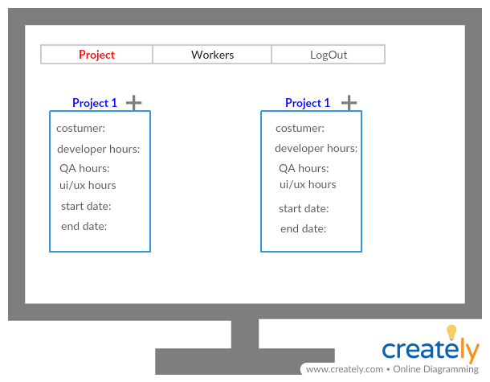

# Finaly project - Task Managment

## Using this technologies:
* MySql
* Web api
* WinForms
* Angular

## System diagram:


***
## Web api
### Models
* Worker:
    * Id - int 
    * Name - string - minLength: 2, maxLength:15, reqiered
    * UserName - string - minLength: 2, maxLength:10, reqiered, uniqe
    * Password - string - minLength: 6, maxLength:10, reqiered
    * Email - string  ,minLength: 6, maxLength:30,reqiered
    * job - int - will contain the id of job's type
    * ManagerName - string -minLength: 2, maxLength:15   
* Project:
    * Id - int 
    * Name - string -  minLength: 2, maxLength:25,uniqe, reqiered,
    * CustomerName - string -  minLength: 2, maxLength:15, reqiered,
    * TeamLeader - `Worker` type - reqiered-  will contain the id of the project manager
    * DevelopHoures - int - reqiered
    * QAHoures - int - reqiered
    * UIUXHoures - int - reqiered
    * StartDate - date - reqiered 
    * EndDate - date - reqiered, must be after `StartDate`
* ProjectWorker:
    * Id - int 
    * Worker - `Worker` type
    * Project - `Project` type
    * AllocatedHours - int 
    * WorkHours - int
* Job:
     * Id - int
     * Name - string

### Controllers
* Home controller:
    * Post - sign in to the system    
    requierd data: 
        * userName
        * password
    If the user is valid - we will check his status and navigate him to the currect main page, Else - we will return a matching error
    * Post - change password
    requierd data: 
        * userName
        * oldPassword
        * newPassword
    If the user want to change your password
* Manager controller:
    * Post - add a new project   
    requierd data: 
        * ProjectName
        * CostumerName
        * TeamLeaderName
        * DevelopHoures
        * QAHoures
        * UIUXHoures
        * StartDate 
        * EndDate 
    If the project details is valid - we will add the project to the DB and also add all the workers that bellow to the team-leader to this projects
    * Post - add a new worker
    requierd data: 
          * Name
          * UserName 
          * Password 
          * Email 
          * job 
          * Manager 
    * Get - get all the details that the manager need to the report
    * Get - get all managers - to choose for each worker your manager
    * Get - get all jobs - to choose for each worker your job type
    * Get - get all workers
    * Get - get presence- get the presence for each worker can be filter by month,project and name
    * Put - edit worker's details 
    requierd data: 
          * Name
          * UserName 
          * Email 
          * job 
          * Manager 
    The manager can not change the worker's password     
    * Delete - the manager can delete worker - It possible to delete just a worker and not a team-leader
* TeamLeader controller:
    * Get - get the details and status of the current project that the team-leader manage
    * Get - get the details for each worker that bellow him
    * Get - get all the hours that used in this month 
    * Get - get worker's hours to each worker
    * Put - update worker's hours - The team-leader need to update for each worker
* Worker controller:
    * Post - the worker can send massage to his team-leader
    * Post - for update the hour that he started to work
    * Get - get the worker details
    * Get - get the project that he work now
    * Get - get all the hours that he worked
***
## WinForms + Angular
### Home page

   
### Manager page
   
 
  
  
  
  
  
### Team-leader page
   
  
 
### Worker page
 
 
 


# Test api with `curl`

### Get Request
```

```

### Post Request (not valid data)
```
curl -v -X POST -H "Content-type: application/json" -d "{\"UserName\":\"DDD\", \"Password\":\"444444\"}"  http://localhost:59628/api/login
```
```
Note: Unnecessary use of -X or --request, POST is already inferred.
*   Trying ::1...
* TCP_NODELAY set
* Connected to localhost (::1) port 59628 (#0)
> POST /api/login HTTP/1.1
> Host: localhost:59628
> User-Agent: curl/7.61.0
> Accept: */*
> Content-type: application/json
> Content-Length: 39
>
* upload completely sent off: 39 out of 39 bytes
< HTTP/1.1 400 Bad Request
< Cache-Control: no-cache
< Pragma: no-cache
< Content-Type: application/json; charset=utf-8
< Expires: -1
< Server: Microsoft-IIS/10.0
< X-AspNet-Version: 4.0.30319
< X-SourceFiles: =?UTF-8?B?QzpcVXNlcnNcc2VsZGF0XERvY3VtZW50c1xHaXRIdWJcVGFza01hb
mFnbWVudDJcVGFza01hbmFnbWVudFxVSUxcYXBpXGxvZ2lu?=
< X-Powered-By: ASP.NET
< Date: Wed, 28 Nov 2018 09:50:14 GMT
< Content-Length: 16
<
"Can not log in"* Connection #0 to host localhost left intact
```
```
curl -v -X POST -H "Content-type: application/json" -d "{\"Name\":\"tryProject\", \"Customer\":\"nnn\",\"TeamLeaderId\":\"11\" , \"DevelopHours\":\"300\",\"QAHours\":\"250\", \"UiUxHours\":\"100\",\"StartDate\":\"2018-02-02\",\"EndDate\":\"2018-07-07\"}"  http://localhost:59628/api/addProject
```
```

```


### Post Request (valid data)
```
curl-7.61.0-win64-mingw\bin>curl -v -X POST -H "Content-type: application/json" -d "{\"UserName\":\"mm\", \"Password\":\"6773ea887f0e3f1c34b01936aaf9687b16a04c6f9e65e4afbfce7bb7f76b0857\"}"  http://localhost:59628/api/login
```
```
Note: Unnecessary use of -X or --request, POST is already inferred.
*   Trying ::1...
* TCP_NODELAY set
* Connected to localhost (::1) port 59628 (#0)
> POST /api/login HTTP/1.1
> Host: localhost:59628
> User-Agent: curl/7.61.0
> Accept: */*
> Content-type: application/json
> Content-Length: 96
>
* upload completely sent off: 96 out of 96 bytes
< HTTP/1.1 200 OK
< Cache-Control: no-cache
< Pragma: no-cache
< Content-Type: application/json; charset=utf-8
< Expires: -1
< Server: Microsoft-IIS/10.0
< X-AspNet-Version: 4.0.30319
< X-SourceFiles: =?UTF-8?B?QzpcVXNlcnNcc2VsZGF0XERvY3VtZW50c1xHaXRIdWJcVGFza01hb
mFnbWVudDJcVGFza01hbmFnbWVudFxVSUxcYXBpXGxvZ2lu?=
< X-Powered-By: ASP.NET
< Date: Wed, 28 Nov 2018 09:55:38 GMT
< Content-Length: 108
<
{"Id":1,"Name":"manager","UserName":"mm","Password":"","JobId":1,"EMail":"manag@
gmail.com","ManagerId":null}* Connection #0 to host localhost left intact
```


