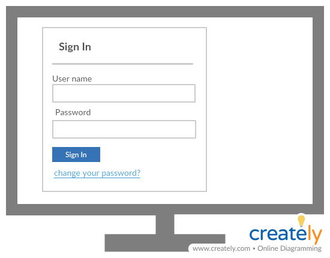
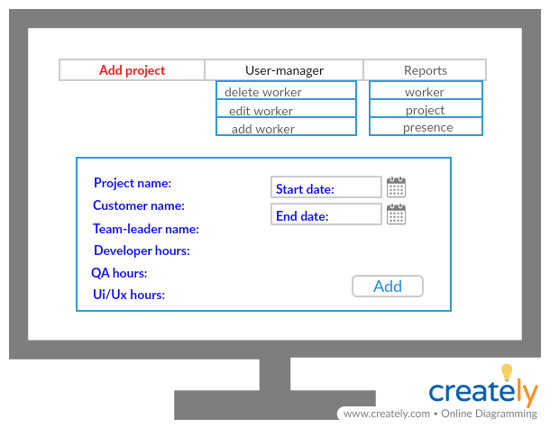

# Finaly project - Task Managment

## Using this technologies:
* MySql
* Web api
* WinForms
* Angular

## System diagram:

***
## Web api
### Models
* Worker:
    * Id - int 
    * Name - string - minLength: 2, maxLength:15, reqiered
    * UserName - string - minLength: 2, maxLength:10, reqiered, uniqe
    * Password - string - minLength: 6, maxLength:10, reqiered
    * Email - string  ,minLength: 6, maxLength:30,reqiered
    * job - int - will contain the id of job's type
    * ManagerName - string -minLength: 2, maxLength:15   
* Project:
    * Id - int 
    * Name - string -  minLength: 2, maxLength:25,uniqe, reqiered,
    * CustomerName - string -  minLength: 2, maxLength:15, reqiered,
    * TeamLeader - `Worker` type - reqiered-  will contain the id of the project manager
    * DevelopHoures - int - reqiered
    * QAHoures - int - reqiered
    * UIUXHoures - int - reqiered
    * StartDate - date - reqiered 
    * EndDate - date - reqiered, must be after `StartDate`
* ProjectWorker:
    * Id - int 
    * Worker - `Worker` type
    * Project - `Project` type
    * AllocatedHours - int 
    * WorkHours - int
* Job:
     * Id - int
     * Name - string

### Controllers
* Home controller:
    * Post - sign in to the system    
    requierd data: 
        * userName
        * password
    If the user is valid - we will check his status and navigate him to the currect main page, Else - we will return a matching error
    * Post - change password
    requierd data: 
        * userName
        * oldPassword
        * newPassword
    If the user want to change your password
* Manager controller:
    * Post - add a new project   
    requierd data: 
        * ProjectName
        * CostumerName
        * TeamLeaderName
        * DevelopHoures
        * QAHoures
        * UIUXHoures
        * StartDate 
        * EndDate 
    If the project details is valid - we will add the project to the DB and also add all the workers that bellow to the team-leader to this projects
    * Post - add a new worker
    requierd data: 
          * Name
          * UserName 
          * Password 
          * Email 
          * job 
          * Manager 
    * Get - get all the details that the manager need to the report
    * Get - get all managers - to choose for each worker your manager
    * Get - get all jobs - to choose for each worker your job type
    * Get - get all workers
    * Get - get presence- get the presence for each worker can be filter by month,project and name
    * Put - edit worker's details 
    requierd data: 
          * Name
          * UserName 
          * Email 
          * job 
          * Manager 
    The manager can not change the worker's password     
    * Delete - the manager can delete worker - It possible to delete just a worker and not a team-leader
* TeamLeader controller:
    * Get - get the details and status of the current project that the team-leader manage
    * Get - get the details for each worker that bellow him
    * Get - get all the hours that used in this month 
    * Get - get worker's hours to each worker
    * Put - update worker's hours - The team-leader need to update for each worker
* Worker controller:
    * Post - the worker can send massage to his team-leader
    * Post - for update the hour that he started to work
    * Get - get the worker details
    * Get - get the project that he work now
    * Get - get all the hours that he worked
***
## WinForms + Angular
### Manager page
   
   
  
### Manager page
   
  
 
### Worker page  
 
 
 

